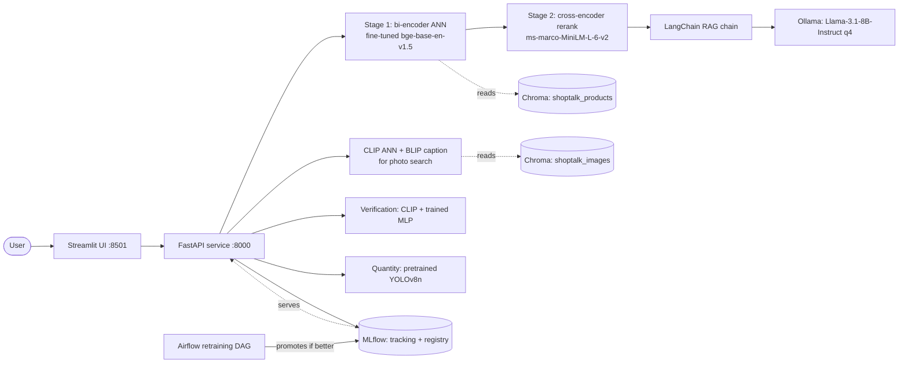

# ShopTalk-X — Project Definition & Execution Guide

*A self-contained reference: what was required, what was built and why,
and a literal start-to-finish path to reproduce the entire system from an
empty directory. Where [PROJECT_EXPLAINED.md](PROJECT_EXPLAINED.md) tells
the story — the problems hit, how they were diagnosed and fixed — this
document is the specification and the runbook: read it top to bottom and
you can rebuild ShopTalk-X yourself, in the same order it was actually
built, with the same reasoning behind each choice.*

---

## Part A — Requirements (what was asked for)

### A.1 Motivation (the business problem)

Keyword search cannot handle a query like *"show me a red shirt for men
under 50 dollars"* — it has no way to understand semantics, synonyms, or
compound constraints. The brief calls for a smart shopping assistant that
takes a natural-language query and returns relevant products with a
natural-language response, built around four pillars: **User Input
Understanding** (complex queries, synonyms, variations), **Retrieval
Augmented Generation** (accurate, fast product matching), **Natural
Language Generation** (coherent, human-like recommendations), and
**Real-Time Responsiveness**.

### A.2 Required deliverables (verbatim scope, from the official brief)

| Category | Requirement |
|---|---|
| Fine-tuned models | Fine-tune a pretrained embedding model on the selected dataset (e.g. triplet loss); LoRA/QLoRA may be used to reduce memory; compare fine-tuned vs. pretrained with a similarity metric and qualitatively. |
| Prototype | A working bot with a basic UI (Streamlit/Gradio) as a REST endpoint on AWS; text query in, generated result + product identifier out. |
| Core functionality | Data preprocessing module; embedding generation module; a vector DB (Chroma/Milvus); image captioning to augment text; exploration of open-source LLMs for generation; a RAG pipeline (from scratch or LangChain) deployed as a REST endpoint; a UI connected to that endpoint; a feedback-loop design. |
| Submission | Colab notebooks + fine-tuned models; preprocessed data + documentation; AWS RAG/inference code + documentation; a video recording of the working bot; `requirements.txt`; a separate system-architecture document; initial results/experience notes; a Dockerfile + deployment steps. |
| Evaluation & testing | Precision testing for retrieval (percent of relevant results in the retrieved set, against a query→positives test set); qualitative testing of generative results; P95/P99 latency; a plan for further testing/improvement. |
| Optional deliverables | Conversational follow-up support; personalization from historical interactions; voice input; an explicit feedback loop (thumbs down). |

### A.3 Grading weightage

| Category | Weight | What it rewards |
|---|---|---|
| EDA & Data Preparation | 15% | Depth of exploratory analysis, NLP preprocessing knowledge, cleaning/structuring rigor. |
| Experimentation with Models | 25% | Fine-tuning depth, model comparisons, language+image integration, code quality. |
| Deployment | 25% | Robust inference API, models loaded once at startup, matching train/inference transformers, REST + Docker deployment. |
| E2E Testing | 15% | Correctness and latency testing across varied cases, results documented. |
| UI/UX | 5% | Working UI, conversational history, clean input/output rendering. |
| Solution Documentation | 15% | Setup + rerun instructions, architecture explanation, full environment/library documentation. |

---

## Part B — Functional definition (what the system does)

### B.1 Capabilities, precisely

| # | Capability | Input | Output | Notes |
|---|---|---|---|---|
| 1 | Text search | Natural-language query, optional `session_id`, `user_name` | Grounded natural-language answer + ranked product hits (item_id, name, category, brand, price, scores) | Two-stage retrieval + LLM generation |
| 2 | Photo search | An uploaded image | Same answer/hits shape as text search | Image is captioned (BLIP) into a pseudo-query and also CLIP-embedded for ANN search |
| 3 | Conversational follow-up | A query + an existing `session_id` | Context-aware answer | History is used by the LLM's *answer*; retrieval itself is stateless per turn (documented limitation — see [PROJECT_EXPLAINED.md](PROJECT_EXPLAINED.md) Part 6) |
| 4 | Order verification | A photo + an `order_item_id` | `match` / `mismatch` / `suspect` + confidence + threshold | `suspect` always routes to human review, never an automatic accusation |
| 5 | Quantity verification | A photo + an `order_item_id` + `claimed_qty` | `match` / `mismatch` / `suspect` / `unsupported` + detected count | `unsupported` for any category outside the pretrained detector's 80 COCO classes |
| 6 | Feedback | `request_id` + rating (+1/-1) + optional comment | Logged, tied to the original request | Feeds a future retraining loop |

### B.2 API surface

| Method & path | Auth | Purpose |
|---|---|---|
| `POST /search/text` | API key | Text query → answer + hits (supports SSE streaming via `stream: true`) |
| `POST /search/image` | API key | Photo upload → answer + hits |
| `POST /verify` | API key | Order photo verification |
| `POST /verify/quantity` | API key | Quantity/count verification |
| `POST /feedback` | none | Thumbs up/down on a prior `request_id` |
| `GET /conversations` / `GET /conversations/{id}` | API key | List/resume a user's past conversations |
| `GET /health` | none | Liveness + which models are loaded |
| `GET /metrics` | none | Prometheus exposition format |

### B.3 Non-functional requirements

- **Real-time responsiveness**: sub-second retrieval + rerank (measured: stage-1 ~100-400ms, rerank ~1.6-6.8s on CPU); LLM generation is the dominant cost end-to-end (design-doc target <2.5s on GPU — see `results/day6_latency_report.md` for the honest CPU-only numbers and why they aren't representative of the GPU target).
- **Never a confident automated accusation**: any match/mismatch decision has a `suspect` band that routes to a human — a deliberate trust-design constraint, not a missing feature.
- **Auth**: API-key gate (`SHOPTALK_API_KEY`) on every endpoint that touches models or user data; public UI, key-protected API, matching the "Public UI, API key required" security model.

---

## Part C — Technical definition (how it's built)

### C.1 Architecture



### C.2 Data pipeline

1. **Source**: Amazon Berkeley Objects (ABO) `listings` shards (JSON, gzipped) + `images/metadata` + `images/small` (256px catalog photos).
2. **Sampling**: filtered to `language_tag: en_US`, sampled down to `target_product_count: 10000` (config-driven, seeded for reproducibility).
3. **Schema after preprocessing** (`data/processed/products.parquet`): `item_id, item_name, category, brand, color, style, description, keywords, document, image_id, image_path, image_available, price_usd, price_is_synthetic, country, domain_name, caption`. `price_usd` is synthetic (ABO has no real pricing) and flagged via `price_is_synthetic`. `document` is the concatenated text blob that gets embedded (name + description + keywords + caption).
4. **Captioning**: BLIP (`Salesforce/blip-image-captioning-base`) generates a caption per catalog image, appended into `document` — this is the mechanism that lets image content influence *text* search too, not just image search.
5. **Embedding**: text embeddings → Chroma collection `shoptalk_products`; CLIP image embeddings → Chroma collection `shoptalk_images` — two separate indexes, one per modality.

### C.3 Models, and why each was chosen

| Purpose | Model | Why |
|---|---|---|
| Text embedding (stage 1) | `BAAI/bge-base-en-v1.5`, fine-tuned | Strong open-source general embedding model; fine-tuning specializes it to this catalog's vocabulary (measured +12.5pp Recall@10). |
| Reranker (stage 2) | `cross-encoder/ms-marco-MiniLM-L-6-v2` | Small, fast cross-encoder; directly scores query-document pairs for higher precision than bi-encoder similarity alone. |
| Image embedding | OpenCLIP `ViT-B-32` (`laion2b_s34b_b79k`) | Open-source, strong zero-shot image-text alignment, no fine-tuning needed for image search. |
| Image captioning | BLIP base | Lightweight, fast enough for batch captioning the whole catalog offline. |
| Generation LLM | `llama3.1:8b-instruct-q4_0` via Ollama | Open-source instruction-tuned model, quantized to run without a dedicated inference server; `qwen2.5:0.5b-instruct` used as a fast stand-in during CPU-only local iteration, documented explicitly as a substitution, not silently. |
| Verification | CLIP embeddings + a small trained MLP (`2048→128→64→1`) | Siamese-style pairwise comparison; MLP head trained specifically on this catalog's hard negatives (ROC-AUC 0.982). |
| Quantity detection | YOLOv8n (Ultralytics), pretrained on COCO | No labeled counting dataset exists for this catalog, so a custom-trained detector was out of scope; pretrained-only, honestly scoped to the ~80 classes it actually knows. |

### C.4 Two-stage retrieval, in detail

Stage 1 (bi-encoder ANN over the whole catalog) trades accuracy for speed;
stage 2 (cross-encoder rerank over just the top `stage1_k=100` candidates)
trades speed for accuracy on a small set. `retrieval.top_k=10` final
results are returned to the caller. Measured uplift from adding stage 2:
Recall@10 +14.7%, MRR +24.9%, NDCG@10 +22.5% (`results/day2_retrieval_eval.md`,
against the base embedding model — see that file's own note on how this
uplift changes once the fine-tuned model is serving stage 1).

### C.5 RAG chain

`shoptalk/rag/chain.py`: reranked hits are formatted into a catalog block
(`format_catalog_block`), combined with conversation history
(`format_history_block`, capped at `llm.conversation_max_turns=6` prior
turns) and the user's query into a prompt with prompt-injection-resistant
delimiting, sent to the LLM, and the raw answer is post-processed into the
API's response shape. Retrieval itself does **not** use conversation
history to reformulate the query — only the LLM prompt does (see Part B.1
row 3, and [QUALITATIVE_EVALUATION.md](QUALITATIVE_EVALUATION.md) for the
live-tested consequence of that).

### C.6 Fine-tuning design

`shoptalk/embeddings/finetune_text.py`: triplet-loss fine-tuning
(anchor=query, positive=matching product, negative=hard negative mined
from the same category via nearest-neighbor search) starting from
`embeddings.base_text_model` (never from `embeddings.text_model`, which
may itself already be a fine-tuned checkpoint — see the config's own
comment on why that separation matters). Evaluated against the frozen
base model via `eval_finetune.py` (Recall@10/50 and Precision@10/50,
brute-force cosine similarity over the full catalog — no ANN approximation
error in the comparison itself).

### C.7 Verification model design

`shoptalk/verification/build_pairs.py` mines positive pairs from ABO's
multi-view images of the same product, and hard negatives from the
nearest CLIP neighbor in the *same category* (visually similar, genuinely
confusable — not a random negative). `train_verification.py` trains the
MLP head on `pair_features()` = `[emb_a, emb_b, |emb_a-emb_b|, emb_a*emb_b]`
(concat + absolute difference + elementwise product — standard pairwise
metric-learning featurization). Inference (`verify.py`) applies a
`SUSPECT_MARGIN=0.15` band around the trained decision threshold.

### C.8 Quantity validation design

`shoptalk/counting/coco_classes.py` maps a product's category or name to
one of COCO's 80 classes (direct category match first, then keyword match
on the product name); `count.py` runs YOLOv8n inference, counts detections
of the matched class above `counting.conf_threshold=0.35`, and compares
against the claimed quantity with `counting.suspect_margin=1`. No match →
`"unsupported"`, by design (see C.3).

### C.9 MLOps

- **MLflow**: every evaluation run (retrieval, fine-tuning, verification,
  personalization) is logged as an experiment run; the retraining DAG
  registers promoted models to the **model registry**
  (`shoptalk-text-embedding`).
- **Airflow retraining DAG** (`airflow/dags/retrain_embeddings_dag.py`):
  `pull_data → rebuild_golden_set → finetune_embeddings → evaluate_and_promote → trigger_deploy`.
  The promotion step is a real regression gate — only promotes if the
  freshly fine-tuned model beats the current base on Recall@10.
- **Drift detection** (`shoptalk/monitoring/drift_report.py`, Evidently):
  compares a reference query window against a current window, flags
  per-column drift.
- **Load testing** (`shoptalk/loadtest/locustfile.py`, Locust).

### C.10 Deployment architecture

Multi-stage `Dockerfile` (builder installs deps, runtime copies a slim
layer) for the API; a separate minimal `docker/ui/Dockerfile` for the
Streamlit frontend (no ML dependencies — it only talks to the API over
HTTP); `docker-compose.yml` (base stack) + `docker-compose.prod.yml`
(GPU-passthrough overlay for Ollama) + `docker-compose.airflow.yml`
(standalone retraining stack). AWS target: EC2 `g4dn.xlarge` (single
NVIDIA T4) — see [deployment/aws_ec2.md](deployment/aws_ec2.md) for the
exact provisioned instance and every host-level configuration step.

---

## Part D — Approach & reasoning (why these choices, and why this order)

- **Why two-stage retrieval instead of a single powerful model over the
  whole catalog**: a cross-encoder alone, run against all 10,000
  products per query, is too slow for real-time use; a bi-encoder alone
  is fast but less accurate. Two stages get both properties where each
  model is strong.
- **Why fine-tune the embedding model at all**: a general-purpose
  pretrained embedding model doesn't know this catalog's specific
  vocabulary, brand names, or category boundaries. Triplet-loss
  fine-tuning with hard negatives closes that gap — measured, not assumed
  (+12.5pp Recall@10 in the actual production retraining run).
- **Why a three-way verdict (`match`/`mismatch`/`suspect`) instead of
  binary**: a binary classifier forces a confident call even right at its
  own decision boundary, which is exactly where it's least trustworthy.
  A margin band around the threshold, routed to a human, converts "the
  model is unsure" from a silent risk into an explicit, safe outcome.
- **Why quantity validation uses a pretrained-only detector**: there is
  no labeled "how many of this product are in this photo" dataset for
  this catalog, and fabricating one was out of scope for this build. A
  pretrained general-object detector, honestly scoped to what it
  actually recognizes (with an explicit `"unsupported"` outcome for
  everything else), was judged more honest than either skipping the
  feature entirely or forcing a custom model onto data that doesn't
  exist.
- **Why retraining is gated on a real comparison, not a schedule alone**:
  the same principle as CI for code — an automated pipeline that
  re-trains and deploys unconditionally can silently regress. Promotion
  only happens if the new model provably beats the old one on the same
  evaluation set.
- **Why this build order (data → retrieval → multimodal → RAG/API →
  fine-tuning/verification/UI → deployment/MLOps → docs)**: each phase
  depends on the previous one's output existing and being trustworthy —
  you cannot evaluate retrieval without data, cannot serve an LLM answer
  without a retrieval pipeline to ground it, and cannot deploy something
  that hasn't yet been shown to work. See Part E for the literal
  execution of this order.
- **Why the tech stack** (brief, tool-by-tool): **Chroma** — open-source,
  embeddable, no separate server process needed for this scale.
  **LangChain** — mature RAG chain primitives, avoids reinventing prompt
  assembly. **Ollama** — simplest way to run a quantized open LLM locally
  or in a container without a heavier serving framework. **FastAPI** —
  async, typed, auto-generates OpenAPI docs (`/docs`) for free, which
  doubles as API documentation. **Streamlit** — fastest path to a working
  UI without hand-writing frontend JS. **MLflow** — de facto standard for
  experiment tracking and a model registry in one tool. **Airflow** —
  the de facto standard for scheduled, dependency-ordered pipelines,
  used here for the retraining DAG specifically because that's a
  multi-step, ordered, occasionally-failing pipeline exactly like the
  ones Airflow is designed for. **Docker** — deployment requirement,
  bonus-scored, and the only practical way to make "load once at startup,
  same transformers train/inference" actually reproducible on a different
  machine.

---

## Part E — Execution guide (build this yourself, start to finish)

### E.0 Prerequisites

- Python 3.11 (3.9+ works; the deployment Docker image targets 3.11).
- ~15GB free disk for the catalog + models + Docker images.
- Docker + Docker Compose v2, for deployment steps.
- [Ollama](https://ollama.com) installed, for the LLM.
- Optional: an AWS account (EC2, IAM permissions for `ec2:*` on at least
  one instance) for the online deployment; a GPU (local or Kaggle/Colab)
  speeds up fine-tuning and captioning significantly but isn't required.

### E.1 Environment setup

```bash
git clone <this-repo-url> shoptalk-x && cd shoptalk-x
python3 -m venv .venv && source .venv/bin/activate
pip install -r requirements.txt      # everything; or requirements/<component>.txt for just one piece
export PYTHONPATH=src
```

All tunable parameters (dataset size, model names, thresholds, paths) live
in **`configs/config.yaml`** — read Part C.2-C.9's tables above alongside
that file; nothing in this guide's commands is a magic number that isn't
also in that config.

### E.2 Step 1 — Data (Day 1)

```bash
python -m shoptalk.data.download_abo     # downloads ABO shards + images, ~10-20 min
python -m shoptalk.data.preprocess       # cleans, samples to target_product_count, writes products.parquet
```

Open `notebooks/01_eda.ipynb` and run all cells — missing-value analysis,
category/brand distribution, price distribution (with the synthetic-price
caveat), description length/vocabulary, image availability, and a closing
section connecting findings to modeling decisions. This is where you
verify your own random sample's category coverage before picking demo
queries later (see [VIDEO_RECORDING_SCRIPT.md](VIDEO_RECORDING_SCRIPT.md)'s
note on why this matters — this project's own 10k sample turned out to
have zero men's shirts).

### E.3 Step 2 — Baseline retrieval + evaluation set (Day 2)

```bash
python -m shoptalk.embeddings.embed_text          # base bge-base-en-v1.5 -> Chroma
python -m shoptalk.retrieval.two_stage --query "red shirt for men under 50 dollars"   # smoke test

python -m shoptalk.eval.generate_golden_set        # builds query -> positive_ids test set
#   -> spot-check data/eval/golden_set_review.csv, hand-edit the .jsonl if needed
docker compose up -d mlflow                        # optional but recommended, UI at :5001
python -m shoptalk.eval.evaluate_retrieval          # Precision@10, Recall@10/50/100, MRR, NDCG@10
```

Check `results/day2_retrieval_eval.md` — this is your Precision/Recall
evidence for the "E2E Testing" and "Model Evaluation and Testing"
requirements.

### E.4 Step 3 — Multimodal: captions + image search (Day 3)

```bash
python -m shoptalk.data.caption_images             # BLIP captions -> appended into products.parquet's document field
python -m shoptalk.embeddings.embed_text            # re-embed now that captions are in the text
python -m shoptalk.embeddings.embed_image            # CLIP image embeddings -> second Chroma collection
python -m shoptalk.retrieval.image_search --image path/to/photo.jpg   # smoke test
```

### E.5 Step 4 — RAG + LLM + API (Day 4)

```bash
ollama serve &
ollama pull llama3.1:8b-instruct-q4_0

uvicorn shoptalk.api.main:app --reload              # :8000, interactive docs at /docs
python -m shoptalk.rag.chain --query "a red shirt for men under 50 dollars" --stream   # smoke test
```

### E.6 Step 5 — Fine-tuning, verification, UI (Day 5)

```bash
python -m shoptalk.embeddings.finetune_text --device auto
python -m shoptalk.embeddings.eval_finetune --finetuned-path data/models/bge-finetuned

python -m shoptalk.verification.build_pairs
python -m shoptalk.verification.train_verification

streamlit run src/shoptalk/ui/app.py                # :8501
```

**Now wire the fine-tuned model into serving** (don't skip this — it's a
real gap this project itself hit): set `embeddings.text_model` in
`config.yaml` to `data/models/bge-finetuned`, keeping
`embeddings.base_text_model` pointed at the original pretrained model so
future retraining always starts from and compares against the true base.
Re-run `embed_text.py` so the live index matches the newly-serving model.

### E.7 Step 6 — Deployment + MLOps (Day 6)

```bash
# Local Docker deployment
docker compose up -d ollama
docker compose exec ollama ollama pull llama3.1:8b-instruct-q4_0
export SHOPTALK_API_KEY="$(openssl rand -hex 24)"
docker compose up -d --build api ui mlflow

# Load test + drift detection
locust -f src/shoptalk/loadtest/locustfile.py --host http://localhost:8000 \
  --users 10 --spawn-rate 2 --run-time 5m --headless --csv results/locust
python -m shoptalk.monitoring.drift_report

# Retraining DAG (standalone Airflow stack)
docker compose -f docker-compose.airflow.yml up --build   # :8080
# trigger manually: airflow dags trigger shoptalk_x_retrain_embeddings
```

For the **online (AWS)** deployment, follow
[deployment/aws_ec2.md](deployment/aws_ec2.md) verbatim — it's written
from an actual execution, including the host-level configuration (swap
file, file permissions after every retrain, EBS volume sizing) that
doesn't live in this repo because it lives on the instance.

### E.8 Step 7 — Quantity validation

```bash
pip install -r requirements/counting.txt   # adds ultralytics on top of the serving chain
python -m shoptalk.counting.count --image path/to/photo.jpg --order-item-id <ID> --claimed-qty 3
```

If deploying via Docker, rebuild the API image after this — see
[deployment/aws_ec2.md](deployment/aws_ec2.md)'s "Deploying a new
dependency" section for two real, specific problems this exact step
caused (disk space from the new CUDA-toolkit dependency chain, a missing
system shared library for `opencv-python`) and their fixes.

### E.9 Step 8 — Stretch goals (optional, but scored)

```bash
python -m shoptalk.personalization.simulate_interactions
python -m shoptalk.personalization.evaluate_personalization
python -m shoptalk.voice.transcribe --audio path/to/clip.wav
```

### E.10 Step 9 — Testing

```bash
pip install -r requirements/dev.txt
ruff check src/ tests/
PYTHONPATH=src pytest tests/ -v
```

For qualitative generative-output testing (a real submission requirement,
not just unit tests), run a handful of real queries against the live API
and judge the answers — see
[QUALITATIVE_EVALUATION.md](QUALITATIVE_EVALUATION.md) for the format to
follow and a worked example set (including one that intentionally
documents a real failure mode, not just successes).

### E.11 Step 10 — Documentation + video

- Write/verify: a system architecture document (this file + [TECHNICAL_ARCHITECTURE.md](TECHNICAL_ARCHITECTURE.md)), model cards per model ([model_cards/](model_cards/)), deployment docs (offline + online), `requirements.txt`.
- Record the demo video following [VIDEO_RECORDING_SCRIPT.md](VIDEO_RECORDING_SCRIPT.md).

### E.12 Configuration reference

Every path/model/threshold used above is a key in `configs/config.yaml`
— see Part C.2-C.9's tables for what each section controls, or open the
file directly (it's ~100 lines, fully commented inline).

### E.13 Troubleshooting (real issues this build hit, condensed)

| Symptom | Cause | Fix |
|---|---|---|
| Docker stack OOMs / extremely slow on Mac | Docker Desktop's default VM memory (2-5GB) is too small for the full model set | Docker Desktop → Settings → Resources → Memory → 12-14GB+ |
| MLflow container fails to bind port 5000 on Mac | macOS reserves 5000 for AirPlay Receiver | Map host `5001:5000` instead (already the default in `docker-compose.yml`) |
| `.gitignore` pattern silently matches nothing | An inline `# comment` on the same line as the pattern isn't stripped by git | Put explanatory comments on their own line, above the pattern |
| Airflow retraining task fails on file writes after succeeding | The task's container user (uid 50000) doesn't have write access to files created by a different user | `sudo chmod -R a+rwX data/ results/` on the host — and re-run after *every* retrain, since new files get the same restrictive default permissions again |
| Airflow retraining task hangs or crashes the whole host | No swap configured; a runaway job has no ceiling | Add an 8GB swap file; set a `mem_limit` on the container |
| A Docker image build runs out of disk space after adding a new ML dependency | A new dependency (e.g. `ultralytics`) pulls a full CUDA toolkit, several GB | Clear Docker's build cache (`docker builder prune -af`); if that's not enough, grow the persistent volume — don't relocate Docker's storage onto ephemeral instance storage |
| `ultralytics`/`opencv` import fails with `libxcb.so.1` missing | `ultralytics` depends on regular `opencv-python` (not headless), which needs GUI-adjacent system libraries the slim base image doesn't have | Install `libgl1 libglib2.0-0 libxcb1 libxrender1 libxext6 libsm6` in the deployment image |
| A conversational follow-up returns irrelevant results | Retrieval always embeds only the current turn's raw text — it doesn't rewrite ambiguous follow-ups using history | Phrase follow-ups to restate their own subject ("black sneakers instead," not "anything cheaper"), or implement query reformulation (see [PROJECT_EXPLAINED.md](PROJECT_EXPLAINED.md) Part 7, item 1) |

---

## Part F — Verification checklist (how to know you did it right)

| Requirement | Evidence file/command to check |
|---|---|
| EDA depth | `notebooks/01_eda.ipynb` — 8 sections, ends with modeling-decision summary |
| Fine-tuned model, compared | `results/day5_finetune_eval.md` (Recall + Precision @10/50, base vs. fine-tuned) |
| Multiple model comparisons | `results/day2_retrieval_eval.md` (stage-1 vs. reranked); `results/day6_latency_report.md` (llama3.1:8b vs. qwen2.5:0.5b) |
| Models loaded once at startup | `src/shoptalk/api/main.py`'s `lifespan` handler |
| Same transformers train/inference | `SentenceTransformer(...)` / `open_clip.create_model_and_transforms(...)` calls are identical in training and inference code paths |
| REST API + Docker | `curl localhost:8000/health`; `docker compose up -d --build` |
| Precision testing | `results/day2_retrieval_eval.md`, `results/day5_finetune_eval.md` (`precision@k` rows) |
| Qualitative generative testing | `docs/QUALITATIVE_EVALUATION.md` |
| P95/P99 latency | `results/day6_latency_report.md` |
| Working UI + conversation history | `streamlit run src/shoptalk/ui/app.py` → chat tab, sidebar past-conversations list |
| Solution documentation | This file + [TECHNICAL_ARCHITECTURE.md](TECHNICAL_ARCHITECTURE.md) + [deployment/](deployment/) + [model_cards/](model_cards/) |
| Video | `docs/VIDEO_RECORDING_SCRIPT.md` followed, video file produced (not tracked in git — keep alongside the repo) |

---

## Where to go next

- The narrative version of this same project — what broke, how it was diagnosed, what's left — is [PROJECT_EXPLAINED.md](PROJECT_EXPLAINED.md).
- Per-model specifics (architecture, training data, eval numbers, limitations) are in [model_cards/](model_cards/).
- The two deployment runbooks are [deployment/offline_production.md](deployment/offline_production.md) and [deployment/aws_ec2.md](deployment/aws_ec2.md).
