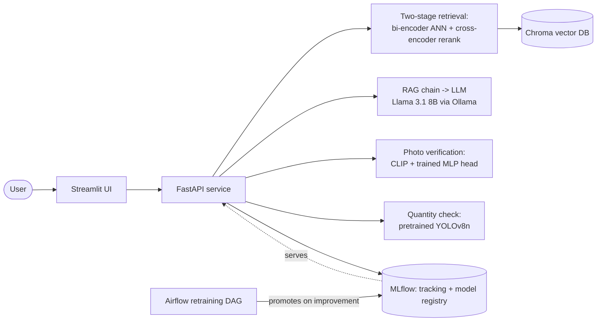

# ShopTalk-X, Explained

*One document, two audiences: if you're here for the business story, read
the first half. If you're here for the engineering story, the second half
is for you. Either way, start with the one-minute version.*

---

## The one-minute version (explain it like I'm 5)

Imagine a shopping helper that:

1. **Understands what you say**, not just keywords — you type "a red shirt
   for men under $50, not striped" and it actually gets what you mean.
2. **Understands pictures too** — show it a photo of something you like,
   and it finds similar things to buy.
3. **Talks back like a person**, not a list of links — "I found this
   jacket, it's $42 and has good reviews, here's why I think it's a good
   match."
4. **Catches mistakes** — if your package arrives and you're not sure it's
   the right item, or the right *amount* of items, you show it a photo and
   it tells you: yes, that matches / no, that's wrong / not sure, let a
   human look.
5. **Gets smarter over time** — every so often, it re-studies its lessons
   using new data and only "graduates" to a smarter version of itself if
   it can prove it actually improved.

That's ShopTalk-X. It's not a real store — it's a demonstration, built to
show that all five of those things can genuinely work together, end to
end, running on real cloud infrastructure, not just in a slideshow.

---

## Part 1 — For the business reader

### 1.1 The problem this solves

Two real, expensive problems in online retail:

| Problem | Cost to the business |
|---|---|
| **Keyword search fails on natural language.** A shopper who searches "red shirt under $50, not striped" against a keyword engine either gets zero results or has to manually filter through everything red. | Lost sales, poor conversion, bad reviews for "the search doesn't work." |
| **Wrong-item and short-count deliveries.** A customer gets the wrong product, a counterfeit, or fewer items than they ordered. Resolving each dispute today usually means a human support agent manually comparing photos and order records. | Returns-fraud and manual-review cost is a multi-billion-dollar line item industry-wide; every dispute a system can correctly auto-resolve (or correctly *not* auto-resolve, and route to a human) saves real support-labor cost. |

ShopTalk-X addresses both: a conversational search experience for
discovery, and an automated (but *not* blindly automated — see §1.3) photo
verification flow for disputes.

### 1.2 What "done" means for a project like this

A prototype that works once, on a laptop, when the developer runs it, is
not the same thing as a system that:
- Runs on real infrastructure a customer could actually hit,
- Has been *measured*, not just claimed, to work better than the naive
  baseline,
- Can be safely updated later without someone re-building it from scratch,
  and
- Is documented well enough that someone who didn't build it could operate
  or extend it.

That's the bar this project was held to, and the second half of this
document is largely the story of closing the gap between "works on my
machine" and that bar.

### 1.3 The trust design: never let the AI make an accusation alone

Two features in this system are capable of "flagging" something as wrong:
the order-photo verifier and the quantity checker. Neither of them is
allowed to output a hard "that's a mismatch/fraud" without a third option:
**"I'm not sure — a human should look at this."**

This matters for a business reason, not just a technical one: an automated
system that occasionally and confidently accuses a genuine customer of
fraud is *worse* than one that sometimes says "I don't know." The former
creates support escalations and PR risk; the latter just means slightly
more human-reviewed cases. Every confidence threshold in this system was
designed with that asymmetry in mind — see §2.3 and §2.4.

### 1.4 What's real right now, in plain terms

This was not a slide deck — it was a genuinely running system, fully
verified live:

- A web app on Amazon's cloud (AWS), reachable over the internet, serving
  a ~10,000-product real catalog — verified with real requests (search,
  photo verification, quantity checks) all returning correct results.
  **Update, 2026-08-13:** the training-lab AWS account this ran on lost
  API and SSH access (an external lab-account expiration, not a defect in
  the app — see [deployment/aws_ec2.md](deployment/aws_ec2.md)'s status
  note); re-checked 2026-08-16, still unreachable. Everything that made
  this work — code, Docker images, documented deployment steps — is
  unaffected and ready to redeploy the moment fresh AWS access exists. The
  local/offline deployment (§ [deployment/offline_production.md](deployment/offline_production.md))
  is unrelated infrastructure and still works today.
- An automated "retraining" process that already ran for real: it
  re-studied the product catalog, produced a measurably smarter search
  model (see §5), and only kept the new version because it proved to be
  better than the old one.
- A quantity-checking feature that, tested against real photos, correctly
  said "looks right," correctly flagged a mismatch, and — just as
  importantly — correctly said "I can't check this one" for products
  outside what it's able to recognize, rather than guessing.

---

## Part 2 — For the technical reader

### 2.1 System architecture, at a glance

Every box in that diagram is a real, running piece of software, not a
placeholder — see [TECHNICAL_ARCHITECTURE.md](TECHNICAL_ARCHITECTURE.md)
for the full, current diagram with every endpoint.

### 2.2 The core technical idea: two-stage retrieval

Searching 10,000 products for "the best 10 matches" the *accurate* way
(comparing the query against every single product with a powerful model)
is too slow to do live. The fix, standard in modern search systems:

1. **Stage 1 — fast and approximate.** Encode every product once, offline,
   into a vector ("embedding"). At query time, encode the query the same
   way and find the ~100 nearest vectors in the whole catalog using an
   approximate-nearest-neighbor index (Chroma). This is fast (milliseconds)
   but not perfectly accurate.
2. **Stage 2 — slow but precise, on a small set.** Take just those 100
   candidates and run a much more accurate (but much slower) model — a
   cross-encoder — that directly compares the query against each candidate
   and re-ranks them. Because it's only looking at 100 items instead of
   10,000, this is affordable.

**Measured result** (`results/day2_retrieval_eval.md`, 100-query golden
set): reranking lifted Recall@10 from 0.688 to 0.789 (+14.7%), MRR from
0.610 to 0.762 (+24.9%), and NDCG@10 from 0.590 to 0.723 (+22.5%) over
stage-1 alone. This is the single biggest lever in the whole system, and
it's a well-established pattern precisely because the numbers back it up.

### 2.3 Why verification has three outcomes, not two

The photo-verification head (a small neural network trained to compare a
received-item photo against the catalog photo) outputs a confidence score
between 0 and 1, not a hard yes/no. A trained threshold splits that score
into three bands:

- Confidently above threshold → **match**
- Confidently below threshold → **mismatch**
- Close to the threshold (within a margin) → **suspect**, routed to a human

This turns a binary decision boundary into three zones on purpose — the
zone nearest the boundary is exactly where the model is *least* sure, and
that's exactly the zone that should never be decided automatically.
**Measured result** (`results/day5_verification_eval.md`, 3,984 pairs):
ROC-AUC 0.982, false-accept rate 5.65%, false-reject rate 10.0%.

### 2.4 Why quantity validation says "unsupported" instead of guessing

The quantity checker uses a **pretrained** object detector (YOLOv8n,
trained on COCO's 80 general object classes — things like "bottle,"
"chair," "book"). It was deliberately *not* custom-trained on this
catalog, because there is no labeled "how many of this are in this photo"
dataset for it to train on, and fabricating one was out of scope.

The honest consequence: most of this catalog's ~50 fine-grained product
categories (the single largest, `CELLULAR_PHONE_CASE`, is 52.8% of the
entire catalog) have no equivalent in COCO's 80 classes. Rather than
quietly returning a meaningless count for a category the detector was
never trained to recognize, `shoptalk.counting.coco_classes.resolve_coco_class`
returns `None` for anything it can't map, and the API returns
`verdict: "unsupported"` with an explanation — never a guess dressed up as
an answer. This is the same trust principle as §2.3, applied to a
different feature.

### 2.5 Why retraining is a gated pipeline, not a cron job that just deploys

The Airflow DAG (`airflow/dags/retrain_embeddings_dag.py`) doesn't just
retrain and deploy on a schedule. It runs a fixed sequence — pull data →
rebuild the evaluation set → fine-tune → **evaluate against the current
production model** → only promote if it's actually better → (placeholder)
trigger a deploy — and the promotion step is a real comparison, not a
formality. This is the same "regression gate" idea used in traditional
software CI (don't ship code that fails tests) applied to a model: don't
promote a model that fails to beat the incumbent.

**This ran for real**, not just as reviewed code: the fine-tuned model
that's live in production right now was produced by this exact pipeline,
and it was promoted because Recall@10 measurably improved from 0.715 to
0.840 (+12.5 percentage points) — see §5 and §7 for the full story of
getting this pipeline to actually complete successfully.

---

## Part 3 — The build journey: what was done, why, and how

The project was built in two phases: a structured 7-day build (the
original scope), followed by a **production-hardening pass** that closed
the gap between "everything is coded and locally demoed" and "everything
is genuinely running in production, verified live."

### 3.1 Phase 1 — the 7-day build

| Day | What | Why this order | How |
|---|---|---|---|
| **1** | Download the ABO catalog, clean it into a consistent table, baseline embedding search | You can't build or evaluate anything without data first, and a baseline gives you something to *beat* later | `download_abo.py` → `preprocess.py` → `embed_text.py` into a Chroma vector index |
| **2** | Add the cross-encoder reranker; build a hand-checked "golden set" of query→correct-answer pairs; wire up MLflow | You can't know if a change made things better without a fixed, trusted way to measure "better" | `generate_golden_set.py`, `eval_retrieval.py`, logged to MLflow for a permanent record of every experiment |
| **3** | Multimodal: caption product images (BLIP) so photo content is searchable as text; add CLIP image-to-image search | Text-only search can't handle "I saw this thing, find similar" | `caption_images.py`, `embed_image.py` into a second Chroma collection |
| **4** | Wire an LLM (Llama 3.1 8B via Ollama) into a RAG chain; expose everything as a FastAPI service | Raw search results are a list; a real assistant should answer in sentences, grounded in real product data | LangChain chain: retrieved products → prompt → LLM → answer, with prompt-injection-resistant delimiting |
| **5** | Fine-tune the embedding model on this catalog specifically; train the photo-verification head; build the Streamlit frontend | A generic pretrained embedding model is good but not *specialized* to this catalog's vocabulary; verification needs its own trained decision boundary | Triplet-loss fine-tuning with hard negatives; Siamese CLIP-embedding comparison + trained MLP; `streamlit run` frontend |
| **6** | Docker Compose deployment; CI/CD pipeline (lint → test → build → deploy); load testing; drift detection; the retraining DAG (built, not yet run for real) | A system nobody can deploy or monitor isn't a system, it's a demo | `docker-compose.yml`, GitHub Actions, Locust, Evidently drift detection, Airflow DAG design |
| **7** | Docs, model cards, LoRA/QLoRA fine-tuning code (execution optional per scope) | Undocumented work is not reusable or auditable by anyone else | Per-model "model cards" (intended use, training data, eval numbers, known limitations — the same discipline real ML teams use) |

Plus two stretch goals completed beyond the core 7 days: **personalization**
(re-ranking blended with a user's interaction history — measured +2.0
percentage points hit-rate uplift) and **voice input** (speech-to-text via
faster-whisper, wired into the chat UI).

### 3.2 Phase 2 — production hardening: closing the "actually works live" gap

At the end of Phase 1, an honest self-assessment found five real gaps
between "built" and "production-ready":

| Gap | Why it mattered | What closed it |
|---|---|---|
| Fine-tuned model wasn't wired into serving | The Day-5 fine-tune existed and was *evaluated*, but the live API was still calling the generic pretrained model — the improvement was proven on paper but not actually delivered to users | Config change (`embeddings.text_model` → the fine-tuned path) + a separate `base_text_model` key so future retraining always starts from the true base, not from itself |
| No live cloud deployment | Everything had only been demonstrated locally | Real AWS EC2 (`g4dn.xlarge`) deployment: the full container stack, reachable over the internet, API-key protected |
| The retraining DAG had never actually run end-to-end | A pipeline that's only ever been code-reviewed, never executed, might not actually work — and it didn't, the first several times (see Part 4) | Ran it for real, debugged it through five distinct real failures until it completed successfully and genuinely promoted a better model |
| Quantity validation was explicitly listed as "not attempted" | It was the last originally-scoped stretch item, deliberately deferred rather than rushed with a fake dataset | Implemented using a **pretrained** detector, honestly scoped to what a pretrained model can actually do (§2.4) |
| Documentation didn't cover a real production deployment | Docs described what *should* happen in AWS; nothing had actually been run there yet to confirm it | Rewrote the AWS doc from what was actually executed, including host-level configuration (a swap file, file permissions, disk sizing) that only exists on the live instance, not in git |

---

## Part 4 — Problems faced, and how they were solved

This is the most instructive part for anyone doing similar work: none of
these were hypothetical. Every one below was a real failure, in the real
running system, that had to be diagnosed from evidence and fixed.

### 4.1 "The retraining pipeline just... hangs"

**Symptom:** the Airflow retraining DAG would run for a while, then the
whole cloud instance would become unresponsive — not even reachable over
SSH.

**First theory (wrong): GPU contention.** The instance runs both a live
LLM (which wants the GPU) and a retraining job. Seemed plausible. Disabled
GPU access for retraining entirely. **The instance still hung on the next
run.** Lesson: a plausible theory isn't a diagnosis — confirm before
declaring a fix.

**Real root cause #1: memory exhaustion, no safety net.** Since SSH itself
was unreachable during the hang, the only way to see what was actually
happening was to write live resource-usage stats (memory, CPU, per-container
usage) to a file *on the instance itself*, independent of any remote
connection — so the evidence would survive even if the connection to
observe it live didn't. That log showed the real story: the retraining
container's memory usage climbed to 11.8GB, system-free memory dropped to
227MB, with **zero swap space configured** as a safety net. Fix: added an
8GB swap file, and a hard memory ceiling on the container so a runaway job
gets killed cleanly instead of taking the whole machine down with it.

**Real root cause #2: a real memory leak, found by comparing two code
paths.** Even with the safety net in place, the same job's memory kept
growing *continuously within a single training epoch* — not just high, but
climbing. The clue that cracked it: the *exact same* training script,
run directly as a normal command, had never shown this problem — only
when called from inside the Airflow scheduler's own long-lived process did
memory grow unbounded. The fix was to make the retraining task launch the
real training script as a genuinely separate process (the way you'd run it
by hand) instead of importing and calling it directly inside Airflow's own
process — a subprocess reliably releases *all* its memory when it exits;
code called in-process inside a long-lived scheduler does not always do so
cleanly.

**A process lesson learned mid-incident:** while the subprocess fix was
still being written and tested, Airflow's own automatic retry fired using
the *old*, still-broken code, and the resulting memory exhaustion was
severe enough to shut the whole cloud instance down (not just hang it) —
requiring a full restart, which also changed the instance's public network
address. After that, the standing rule became: **pause the automated
pipeline the moment you start debugging it**, so an unattended retry can
never race an in-progress fix.

### 4.2 "The fix didn't work, and I can't even see why"

Once the subprocess fix was in place, the next failure showed a genuine
five-minute *gap* in the log — nothing printed between "starting" and
"failed" — even though the actual script (run standalone) clearly prints
plenty of output. Root cause: launching a subprocess and simply checking
whether it succeeded doesn't automatically forward *that subprocess's own
output* into the parent job's log — only what the parent process itself
prints gets captured. Fix: explicitly capture the subprocess's output and
print it from the parent. Small technical detail, but it's the difference
between an opaque failure and a debuggable one — this exact tool
(`_run_subprocess` in the DAG code) is why every subsequent failure in this
story was diagnosable at all.

### 4.3 "It trained successfully... then failed anyway"

With real output finally visible, the actual error appeared:
*permission denied* writing the newly-trained model file. The training had
completed in full — the failure was purely in *saving the result*. Root
cause: the retraining process runs as a different system user than the one
that had previously created the target folder, and that folder wasn't
writable by anyone else. Fixed with a one-time permission change — **twice**,
because the same issue independently recurred in a second output folder
(evaluation results) the retraining run also writes to, on the very next
attempt. The lesson generalized into a documented, standing operational
note: *any* file a scheduled job creates fresh will carry that job's own
default (restrictive) permissions — a one-time fix only covers files that
already exist at the moment you run it, not files created afterward.

### 4.4 "The image build ran out of disk space"

Adding the quantity-validation feature meant adding a new, fairly heavy
machine-learning library. Building the updated deployment image failed
twice with "no space left on device." The tempting quick fix — the cloud
instance had a second, much larger disk sitting mostly empty — turned out
to be a trap: that second disk is **temporary** storage that gets wiped
every time the instance is stopped and restarted (a completely normal,
already-documented cost-saving routine for this project). Relocating
critical data there would have created a silent, deferred data-loss bug.
The correct fix was less convenient but durable: grow the actual persistent
disk. This is a good example of a fix that's *easy* being different from a
fix that's *right*.

### 4.5 "It built and started fine, but the feature crashed on first real use"

After the image built successfully, the very first real call to the new
quantity-check feature failed with a missing-library error — but only on
that first real call, not at start-up, because that library is only loaded
the moment it's actually needed (deliberately, to keep normal start-up
fast). Root cause: the object-detection library depends on a general-purpose
image library, and the minimal base operating system used for the
deployment image doesn't include a few small system libraries that
general-purpose library expects to be present. Fixed by explicitly
installing those specific libraries in the image build.

### 4.6 Smaller issues along the way (worth knowing, quick to describe)

- **A configuration mismatch bug that predates this whole project's habit
  of catching it early:** a comment placed on the same line as a file-ignore
  rule was silently swallowing the entire rule, once nearly causing a
  440MB trained-model folder to get committed to source control by
  accident. The fix — and now the standing rule — is that explanatory
  comments in that particular kind of config file always go on their own
  line, never appended to a rule.
- **A local development environment simply not given enough memory**
  caused a ~7x slowdown that looked at first like a hardware/model-size
  problem — it wasn't; raising the allocated memory for the local
  container environment fixed it completely, with zero code changes.
- **A network-port collision on Mac** (macOS reserves a common default port
  for its own AirPlay feature) meant a service had to be told to listen on
  a different port than its default — a five-minute fix once identified,
  but a confusing "why won't this even start" symptom until then.

---

## Part 5 — What's actually measured (not claimed)

Every number below comes from a real evaluation run against real data,
logged to files still in this repository — nothing here is an estimate.

| What was measured | Result |
|---|---|
| Reranking uplift over baseline search | Recall@10 +14.7%, MRR +24.9%, NDCG@10 +22.5% |
| Embedding fine-tuning uplift (the real production retraining run) | Recall@10: 0.715 → 0.840 (+12.5 percentage points) |
| Photo-verification accuracy | ROC-AUC 0.982, false-accept rate 5.7%, false-reject rate 10.0% |
| Personalization re-ranking uplift | Hit-rate@10: 0.960 → 0.980 |
| Simulated data-drift detection | Correctly flagged 7/7 drifted signal columns on a deliberately shifted query set |
| Quantity-check feature, live spot test | Correctly matched a real product photo, correctly flagged a real mismatch, correctly declined ("unsupported") a photo outside its recognizable categories |

---

## Part 6 — Known limitations (stated plainly, on purpose)

- **Quantity validation only covers a fraction of the catalog** — it's
  built on a general-purpose, pretrained object detector with ~80 known
  object types, not a system trained on this specific catalog's ~50
  fine-grained categories. This was a deliberate scope decision (no labeled
  dataset existed to train something more specific), not an oversight, and
  it's the app's honest behavior to say "can't check this one" rather than
  guess.
- **Product pricing is synthetic** — the underlying open dataset (Amazon
  Berkeley Objects) doesn't include real prices, so plausible placeholder
  prices were generated. This is flagged everywhere it's shown in the app.
- **The verification model was trained on a few thousand example pairs**,
  not the full theoretical scale a mature production system would use —
  real-world deployment would mean continuously growing that training set.
- **Large-model (LoRA) fine-tuning code exists but wasn't executed** — it
  needs real GPU time that wasn't allocated to this pass; the code and
  approach are documented and ready to run.
- **A full container-orchestration deployment (Kubernetes) was scoped out**
  in favor of a single well-documented instance — the right call for this
  project's scale, but a real growth-stage product would eventually need it.
- **Conversation history doesn't yet reformulate the retrieval query** —
  found live, not in a design review: the LLM's *answer* correctly uses
  prior turns (it carries over constraints like a price ceiling without
  them being repeated), but *retrieval* always embeds only the current
  turn's raw text. A follow-up like "anything cheaper than that?" — no
  product category restated — retrieves irrelevant candidates, because
  nothing rewrites "that" into what it refers to before the search runs.
  A follow-up that restates its own subject ("black sneakers instead")
  works correctly. See
  [QUALITATIVE_EVALUATION.md](QUALITATIVE_EVALUATION.md) examples 3-4 for
  the side-by-side failure and success, with the exact request/response
  pairs.

---

## Part 7 — Further improvements and next steps

Roughly in priority order, if this were to continue as a real product:

1. **Add query reformulation before retrieval**, using conversation
   history — the single most concrete, well-understood gap found this
   pass (see Part 6). A standard fix: before embedding a follow-up query,
   have the LLM rewrite it into a self-contained query using the prior
   turn(s), the way many production RAG systems handle multi-turn search.
2. **Close the human-feedback loop.** Thumbs-up/thumbs-down feedback is
   already captured and logged; the next step is feeding it back into what
   the retraining pipeline learns from, not just storing it.
3. **Widen quantity-validation coverage.** Either fine-tune the object
   detector on catalog-specific categories, or invest in a small labeled
   counting dataset for the highest-value product categories first.
4. **Real alerting, not just detection.** Drift detection already works;
   wiring its output into an actual paging/notification system (e.g.
   Slack, PagerDuty) is what turns "we could have caught this" into
   "we did catch this."
5. **Per-category confidence calibration** for the verification and
   quantity-check "suspect" bands — right now the same fixed margin applies
   everywhere; some product categories are inherently harder to compare
   visually than others and would benefit from their own calibrated
   threshold.
6. **Execute the LoRA fine-tuning step for real** on real GPU time, closing
   the last "documented, not executed" item.
7. **Load-test against real (GPU) infrastructure** — the current latency
   numbers were captured on CPU-only hardware and explicitly flagged as not
   representative of a real deployment target.
8. **Automate the operational gotchas found in Part 4** rather than
   documenting them as manual steps — e.g., have the retraining pipeline
   fix its own file permissions after every run, instead of relying on a
   person remembering to.

---

## Part 8 — How a real-world team would run this

A capstone project is built by one person under time pressure. A real
product with these same capabilities would be organized differently:

**Team & ownership.** Distinct (if overlapping) roles: ML engineers own
model quality and the retraining pipeline; backend engineers own the API
and its reliability; an MLOps/platform engineer owns deployment,
infrastructure, and the CI/CD pipeline itself; a product manager owns what
"suspect" thresholds and quantity-coverage gaps mean for the actual
customer experience — decisions like "is a 10% false-reject rate
acceptable for this product line" are business calls, not purely technical
ones.

**Environments, not just "prod."** A real system has separate development,
staging, and production environments, with changes promoted through them
in order — never editing production directly the way a single-instance
demo project reasonably does.

**CI/CD with real gates, not just automation.** The pipeline in this
project already lints, tests, and can build/deploy; a production version
would add: mandatory code review before merge, automated model-quality
gates (not just "does it beat the old model" but "does it regress on any
protected sub-group or category"), canary/gradual rollouts instead of an
instant full swap, and automatic rollback on error-rate or latency
regressions.

**Observability, not just logging.** Prediction logging and drift
detection already exist here; a production system adds real-time
dashboards, SLO-based alerting, and on-call rotation with defined incident
response — the difference between *being able to* find a problem and
*being told about it* the moment it starts.

**Security and secrets management.** Credentials in this project were
handled carefully by hand (never committed, stripped from git remotes
after use); a real team uses a managed secrets store (AWS Secrets Manager,
Vault, etc.), least-privilege IAM roles per service (not one broad
developer credential), and regular credential rotation.

**Cost management as an ongoing discipline**, not a one-time decision —
right-sizing instances, autoscaling to real traffic instead of running a
fixed instance size, and regular review of what's actually being paid for
versus used (this project already practices a version of this: stopping
the cloud instance when not actively in use).

**Data and model governance.** Any system that makes automated
match/mismatch or quantity decisions about real customers' orders would,
in a real company, go through fairness/bias review across product
categories and demographics, a documented human-escalation SLA (how fast
does a "suspect" case actually get reviewed by a person), and periodic
re-validation that the training data itself still represents what's
actually being sold.

**Documentation as a living artifact**, not a one-time deliverable — model
cards, architecture docs, and runbooks like this one are most valuable when
they're kept current as the system changes, which is itself a process a
real team has to own, not just produce once.

---

## Where to go next in this repo

- **See it running / try it yourself** → [USAGE_WALKTHROUGH.md](USAGE_WALKTHROUGH.md)
- **Deploy it yourself, locally** → [deployment/offline_production.md](deployment/offline_production.md)
- **Deploy it yourself, on AWS** → [deployment/aws_ec2.md](deployment/aws_ec2.md)
- **Every model's specifics** (training data, eval numbers, known failure modes) → [model_cards/](model_cards/)
- **Full technical architecture diagram** → [TECHNICAL_ARCHITECTURE.md](TECHNICAL_ARCHITECTURE.md)
- **The original spec this was built against** → [ShopTalk-X_Production_Design_Document.md](ShopTalk-X_Production_Design_Document.md)
