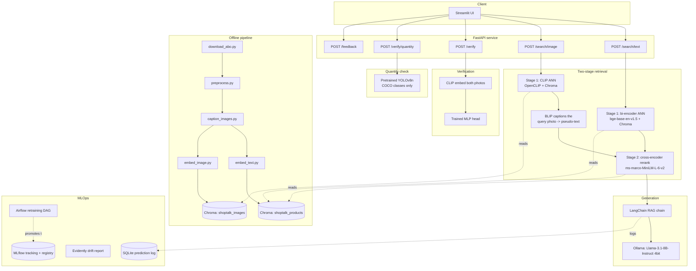

# ShopTalk-X — Technical Architecture

*How the system is built and why. For "what it does," see [FUNCTIONAL_OVERVIEW.md](FUNCTIONAL_OVERVIEW.md). For the original spec, see [ShopTalk-X_Production_Design_Document.md](ShopTalk-X_Production_Design_Document.md).*

## System diagram

## Two-stage retrieval

**Why two stages instead of one?** A bi-encoder (embed query, embed
documents, compare vectors) is fast enough to search 10k products in
milliseconds, but its accuracy ceiling is limited because query and
document never "see" each other during scoring. A cross-encoder (feed
`[query, document]` through the model together) is much more accurate but
too slow to run over an entire catalog — it has to redo the full forward
pass for every single candidate. The standard production pattern (Google/
Amazon-scale search) is to use the bi-encoder to cheaply narrow 10k → 100,
then spend the cross-encoder's cost only on those 100.

**Measured proof this actually helps** (`results/day2_retrieval_eval.md`,
300-product validation run): reranking lifted Recall@10 by +10.5pp, MRR by
+11.3pp, NDCG@10 by +14.6pp — while Recall@100 stayed flat (as expected: the
reranker reorders the stage-1 candidate pool, it doesn't expand it).

**Image queries reuse the same reranker.** A cross-encoder needs a text
query to pair against candidate documents, but an uploaded photo has none.
Rather than build and maintain a second, image-specific reranker, the query
photo itself gets BLIP-captioned into a pseudo-text query
(`shoptalk/retrieval/image_search.py`), which then flows through the exact
same reranking code path as a typed query. One reranker, two entry points.

## Component map (by build day)

| Day | Module | Purpose |
|---|---|---|
| 1 | `shoptalk/data/download_abo.py`, `preprocess.py` | Pull + clean the ABO catalog subset |
| 1 | `shoptalk/embeddings/embed_text.py`, `retrieval/search.py` | Baseline single-stage text search |
| 2 | `shoptalk/retrieval/rerank.py`, `two_stage.py` | Cross-encoder reranking |
| 2 | `shoptalk/eval/generate_golden_set.py`, `evaluate_retrieval.py` | Test dataset + Recall/MRR/NDCG harness |
| 3 | `shoptalk/data/caption_images.py`, `embeddings/embed_image.py` | BLIP captions, CLIP image index |
| 3 | `shoptalk/retrieval/image_search.py` | Photo-as-query search |
| 4 | `shoptalk/rag/prompts.py`, `chain.py` | LangChain RAG: retrieve → prompt → LLM |
| 4 | `shoptalk/api/main.py`, `schemas.py`, `security.py`, `logging_store.py` | FastAPI service |
| 5 | `shoptalk/embeddings/finetune_text.py`, `eval_finetune.py` | Triplet-loss embedding fine-tuning |
| 5 | `shoptalk/verification/*` | Siamese pairs, MLP training, inference |
| 5 | `shoptalk/ui/app.py` | Streamlit frontend |
| 6 | `Dockerfile`, `docker-compose*.yml`, `.github/workflows/ci.yml` | Containerization + CI/CD |
| 6 | `shoptalk/loadtest/locustfile.py`, `monitoring/drift_report.py` | Load testing, drift detection |
| 6 | `airflow/dags/retrain_embeddings_dag.py` | Retraining orchestration |

## Key design decisions and why

- **Chroma with two separate collections** (`shoptalk_products` for text,
  `shoptalk_images` for CLIP) rather than one joint space — text and image
  embeddings live in different vector spaces (different models, different
  dimensionality conventions); merging them would make similarity scores
  meaningless across modalities.
- **Manual conversation-history state, not a LangChain Memory object** — an
  explicit list of `{role, content}` turns owned by the API layer
  (`shoptalk/api/main.py`'s in-memory `_state["sessions"]`) is easier to
  reason about and to serve statelessly across requests than LangChain's
  (soft-deprecated) Memory abstractions. Swap for Redis before scaling past
  one instance.
- **SQLite for prediction logging** (`shoptalk/api/logging_store.py`) —
  every request's query, retrieved IDs, rerank scores, LLM output hash, and
  latency breakdown, at this project's scale. Swap for Postgres/S3 parquet
  at higher volume without changing call sites.
- **Synthetic price, clearly flagged** — ABO has no price field, but the
  spec's example queries assume one exists. Rather than silently omit
  price-filtering or fabricate it invisibly, every product record carries
  `price_is_synthetic: true` and the README/functional overview say so
  explicitly.
- **Prompt-injection defense via delimiting, not just instruction** —
  retrieved product text is wrapped in `<product item_id="...">` blocks
  with an explicit system-prompt rule that content inside is data, not
  commands (`shoptalk/rag/prompts.py`).
- **`suspect` verdict band, not binary match/mismatch** — the verification
  head outputs a probability; a margin around the trained threshold routes
  ambiguous cases to human review rather than forcing an automatic
  accusation (design doc §8).

## Latency: the honest numbers

This project was built and validated in a **sandboxed environment with no
GPU/Metal access** — Ollama fell back to CPU-only inference, and a single
LLM generation there took 30 seconds to 3+ minutes depending on concurrent
load, versus the <2.5s design target on real GPU hardware. This is a
constraint of the build environment, not the code: the same retrieval and
serving code is expected to hit the design doc's SLOs (§4.2) on the
G4dn.xlarge / Kaggle-GPU / working-Metal-Mac hardware it's actually meant to
run on.

What **was** validated at real, meaningful speed in this environment:
- Stage-1 ANN retrieval: ~200ms
- Cross-encoder reranking (100 candidates): ~1.5s (target: <300ms on GPU —
  CPU-bound here too)
- CLIP image embedding + verification inference: a few seconds, no LLM
  involved

`src/shoptalk/loadtest/locustfile.py` is real, working load-test code — run
it against your actual deployment (`locust -f ... --host <your-api> --users
20 --spawn-rate 2 --run-time 5m --headless --csv results/prod_locust`) for
SLO numbers that mean something.

## Testing / validation approach

- **26+ pytest unit tests** (`tests/`) covering pure logic: text cleaning,
  synthetic pricing, prompt formatting, config resolution, the verification
  model's tensor shapes — fast, no model downloads, run in CI on every push.
- **Every pipeline stage was also run end-to-end against real data** pulled
  live from the ABO S3 bucket during development (not just unit-tested in
  isolation) — real downloads, real embeddings, real LLM calls, real API
  requests over HTTP, a real trained verification model. Bugs this caught
  (documented in `docs/CONVERSATION_LOG.md` and commit messages): a keyword
  field being duplicated 5-8x from repeated locale tags, BLIP's
  repetition-loop decoding failure, an MLflow metric-naming restriction,
  and a ruff auto-fix that introduced Python-3.10-only syntax into a
  Pydantic model.
- **`ruff check` (pyflakes + pycodestyle + import-sort)** runs in CI;
  `pip-audit` scans dependencies for known CVEs (non-blocking, for review).

## What's not covered here

Data schema, dataset provenance, and preprocessing rationale are in the EDA
notebook (`notebooks/01_eda.ipynb`) and the Day-1 section of
`docs/ShopTalk-X_7Day_Execution_Plan.md`. Per-model training data, eval
numbers, and failure modes are in `docs/model_cards/`. Deployment
step-by-step is in `docs/deployment/aws_ec2.md`.
