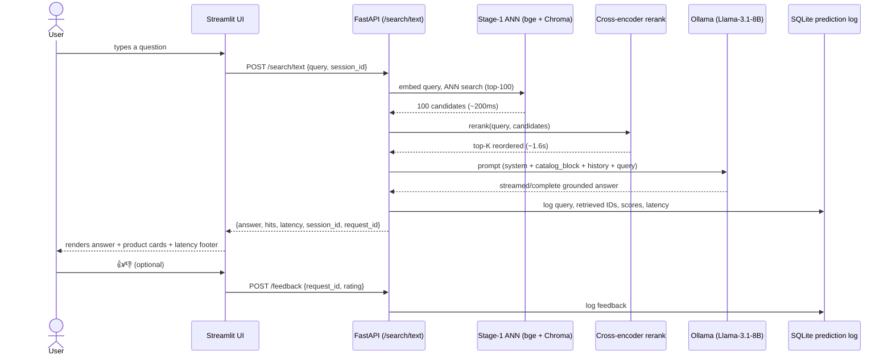
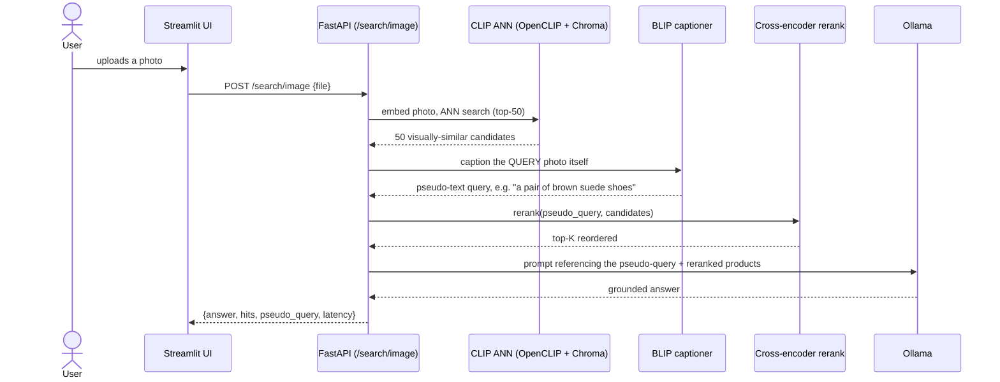
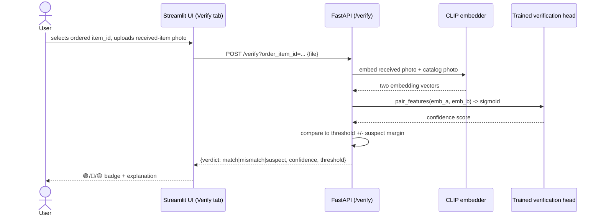
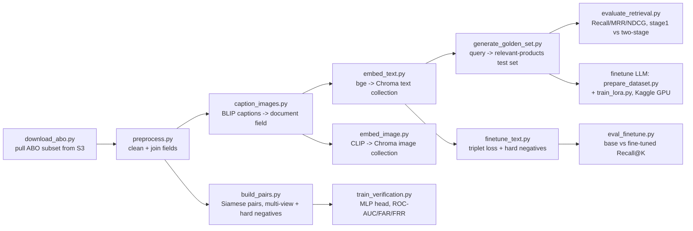
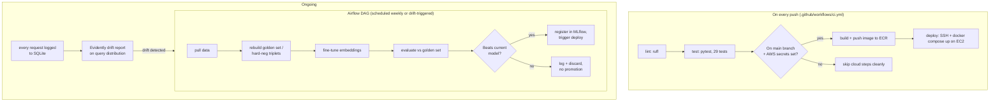

# ShopTalk-X — Workflows

*Visual walkthroughs of how a request moves through the system, and how the
system itself gets built, deployed, and kept up to date. Pairs with
[USAGE_WALKTHROUGH.md](USAGE_WALKTHROUGH.md) (how to click through the app)
and [TECHNICAL_ARCHITECTURE.md](TECHNICAL_ARCHITECTURE.md) (component map,
design decisions).*

## 1. Text search — request workflow

What happens between you typing a question and getting an answer.

**Measured, real numbers for this exact flow** (500-product local
deployment, CPU-only): stage-1 ~224ms, rerank ~1,637ms, LLM ~16.8 min (see
`results/day6_latency_report.md` for the full breakdown and why the LLM
step dominates on this hardware).

## 2. Photo search — request workflow

Same shape, different stage-1/rerank inputs.

The reranker never sees the photo — only the BLIP-generated caption. This
is why photo-search quality depends on caption accuracy (see
`docs/model_cards/clip_and_captioning.md`).

## 3. Order verification — request workflow

`suspect` never auto-accuses — it's a deliberate band around the trained
threshold that routes ambiguous cases to a human (design doc §8).

## 4. Data + model pipeline — build workflow

What "building the catalog" actually runs, in order, once.

Every box is a real, independently runnable `python -m shoptalk....` command
(see the README's "Full pipeline" section for the exact commands and order).

## 5. CI/CD + retraining — operational workflow

The retraining DAG's promotion gate was validated directly against real
trained models (see `airflow/dags/retrain_embeddings_dag.py`'s
`task_evaluate_and_promote` and the commit history) — it only promotes a
new model version to the MLflow registry if it actually beats the current
one on the golden set, never blindly.

## Where each workflow's code lives

| Workflow | Entry point(s) |
|---|---|
| Text search | `shoptalk/api/main.py::search_text`, `shoptalk/rag/chain.py` |
| Photo search | `shoptalk/api/main.py::search_image`, `shoptalk/retrieval/image_search.py` |
| Verification | `shoptalk/api/main.py::verify`, `shoptalk/verification/verify.py` |
| Data/model pipeline | `shoptalk/data/`, `shoptalk/embeddings/`, `shoptalk/eval/`, `shoptalk/verification/` |
| CI/CD | `.github/workflows/ci.yml` |
| Retraining | `airflow/dags/retrain_embeddings_dag.py` |
| Monitoring | `shoptalk/monitoring/drift_report.py`, `shoptalk/api/logging_store.py` |
